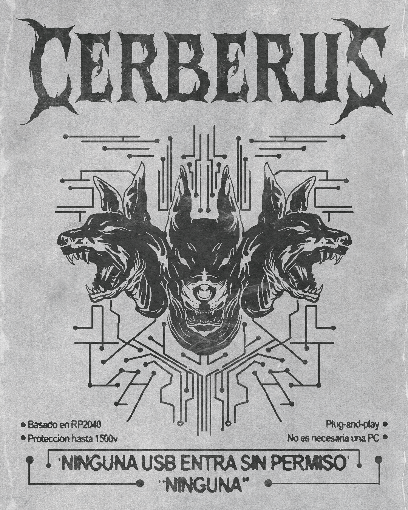

# Cerberus
<p align="center">
  
</p>

<p align="center">
  <strong>Developed by Lab217</strong><br>
  No USB gets in without permission. NONE
</p>

<p align="center">
  <sub>Proudly sponsored by</sub><br>
  <a href="https://www.pcbway.com/"></a>
</p>


**🌐 [English](README.md) · [Español](README.es.md) · [Português](README.pt.md)**

---

## What is Cerberus?

**Cerberus is a pocket-sized device where you plug in any suspicious USB to see, in real time, what it tries to do to a computer — before you risk your own.**

Instead of blindly trusting a flash drive you found or were handed, you plug it into Cerberus first: the device pretends to be a normal PC, watches how the USB behaves, and instantly warns you if it tries to type on its own (BadUSB / Rubber Ducky), read or write files without permission, or fry the port with a voltage spike (USB Killer). Everything is shown on an OLED screen, a color LED, and over the serial port.

### Key features

- **Detects BadUSB / Rubber Ducky** — spots automated typing that's impossible for a human.
- **Detects USB Killer** — alerts on high-voltage spikes (and blocks them with the optional isolator).
- **Watches reads and writes** — warns if the USB tries to read `AUTORUN`/`README` or write/delete files on its own.
- **Suspicious-device database** — recognizes known attack hardware by its VID/PID.
- **Full visibility** — OLED screen, NeoPixel LED, and serial console showing everything that happens.
- **Forensics & red team** — captures keystrokes, exports to DuckyScript, and stores info on the last device.

> Built for cybersecurity professionals (SOC, blue team, and red team) as a USB test bench, BadUSB payload debugger, and basic forensic triage tool. Built on top of [USBvalve](https://github.com/cecio/USBvalve).

---

## Installation

### Prerequisites

- Install the Arduino IDE
- `Adafruit TinyUSB Library` version `>=3.6.0`
- `Pico-PIO-USB` version `>=0.7.2`
- Boards `Raspberry Pi RP2040 (4.5.4)` with CPU Speed at `133MHz` and Tools => USB Stack set to `Adafruit TinyUSB`
- `Adafruit_SSD1306` OLED library version `>=2.5.14`
- Raspberry Pi Pico 1 or 2 (or another RP2040-based dev board)
- 128x64 or 128x32 I2C OLED display (SSD1306)

### Steps

---

#### Using the precompiled version

In GitHub, go to Releases and find the most recent `.uf2` file, then download it.

To flash the image:

- Connect the Raspberry Pi Pico with a USB cable while holding the _BOOTSEL/BOOT_ button.
- Release the button.
- A new device named `RPI-RP2` will appear on your system (on Linux you'll probably have to mount it manually).
- Copy the `.uf2` file into the folder, depending on your OLED display.
- Wait a few seconds until the device disappears.

#### Compile your own version

Get the repo locally:

```bash
git clone https://github.com/Glitchboi-sudo/Cerberus-A-USB-Watchdog.git
```

With the Arduino IDE:

- Open `Software/Cerberus/Cerberus.ino`.
- Connect the Raspberry Pi Pico with a USB cable.
- Select the Pico in Arduino.
- Tools -> USB Stack -> Adafruit TinyUSB
- Click `Upload`.

---

## Usage

The idea is simple: **Cerberus sits between your computer and the USB you want to inspect**, acting as a decoy so the suspicious device reveals its real behavior.

### Step by step

1. **Power Cerberus.** Connect it to your computer with a USB cable (the RP2040's native port). On boot, the OLED shows "Selftest: OK" and the LED turns **blue**: ready to go.
2. **Plug the suspicious USB** into Cerberus's host port (not into your computer).
3. **Watch the reaction in real time.** Cerberus pretends to be a PC and lets the device act. The screen, the LED, and the serial console tell you immediately what it's trying to do.
4. **Read the verdict** using the indicator table below: blue = normal, red/orange/magenta = suspicious.
5. **(Optional) Dig deeper** with the physical buttons to view USB descriptors, or with the serial commands for forensic analysis and keystroke capture.

### Screen and LED indicators

| Event                       | OLED message       | LED color |
| --------------------------- | ------------------ | --------- |
| Ready/Normal                | "Cerberus Ready"   | Blue      |
| README read                 | "README (R)"       | Blue      |
| AUTORUN read                | "AUTORUN (R)"      | Blue      |
| Write detected              | "WRITING"          | Blue      |
| Delete detected             | "DELETING"         | Blue      |
| HID device connected        | "HID Device"       | Red       |
| HID sending data            | "HID Sending data" | Red       |
| Suspicious device           | "SUSP: [name]"     | Orange    |
| Automated typing (BadUSB)   | "AUTO [X] k/s"     | Magenta   |
| USB Killer detected         | "USB Killer"       | Red       |
| Mass storage device         | "Mass Device"      | Green     |

### Physical buttons

- **BTN_RST**: Cycle through the USB descriptor pages of the connected device
- **BTN_OK**: Exit the descriptor view / refresh the screen
- **BOOTSEL**:
  - Short press: Reboot the device
  - Press >2s: Show the HID event count

### Serial port commands

Connect over serial (SerialTinyUSB) and type these commands:

| Command    | Description                                |
| ---------- | ------------------------------------------ |
| `HELP`     | Show the list of commands                  |
| `STATUS`   | Current device status                      |
| `LAST`     | Forensic info on the last connected device |
| `RESET`    | Reset counters                             |
| `REBOOT`   | Reboot the device                          |
| `VERBOSE`  | Toggle verbose mode                        |
| `HEXDUMP`  | Toggle hex dump                            |
| `HIDDEBUG` | Toggle HID debug (raw bytes)               |
| `CLEAR`    | Clear info on the last device              |

---

## How does it detect threats?

Cerberus doesn't just cut the data lines: **it impersonates a real computer** so the suspicious device reveals its intentions, and it watches four fronts at once.

- **Automated typing (BadUSB / Rubber Ducky).** Cerberus measures the keystroke rate of the emulated keyboard. No human types dozens of keys per second, so when it crosses that threshold it flags an automated attack and shows the detected speed.

- **Malicious reads and writes.** Cerberus exposes a small virtual disk with bait files (`README`, `AUTORUN`). If a USB — or the malware on it — tries to read those files automatically, or write/delete content without your input, it's exposed instantly.

- **Known attack devices.** On connection, Cerberus reads the device identifiers (VID/PID) and compares them against a database of known attack hardware, warning you if it recognizes one.

- **USB Killer.** A hardware circuit monitors the port voltage; on a high-voltage spike it fires an immediate alert. With the galvanic isolator, the discharge is also **physically blocked** so it never reaches your computer.

Each detection is turned right away into a message on the OLED, an LED color, and a line over the serial port, giving you a clear verdict without having to risk a real machine.

---

## Hardware

The `Hardware/` folder contains the project's PCB designs.

### Schematic

📄 [Cerberus schematic (PDF)](SCH_Schematic1_2026-06-15.pdf)

### CerberusZero.epro

The complete Cerberus PCB. Includes the integrated circuit with the RP2040, USB connectors, OLED display, and all necessary components.

- **Format**: EasyEDA Pro project
- **How to open**: Import into EasyEDA Pro from `File → Open`

### ADUM3160 USB Isolator

A USB galvanic isolation module based on the ADUM3160 chip. Provides **protection against USB-Killer attacks** by electrically isolating the host from the device, blocking high-voltage spikes.

- **Use**: Optional add-on for an extra layer of physical security
- **Speed**: USB 2.0 Full Speed (12 Mbps)
- **More info**: See `Hardware/ADUM3160 USB Isolator/README.md`

---

## Software Architecture

### Firmware (Cerberus.ino)

The firmware uses both cores of the RP2040:

- **Core 0**: Handles the user interface (OLED, NeoPixel LED, buttons) and emulates a USB storage device to detect suspicious host activity.
- **Core 1**: Runs the USB Host stack via PIO to monitor connected devices (HID, Mass Storage, CDC).

**Main modules:**

- **Threat detection**: USB Killer (via hardware interrupt), suspicious devices (VID/PID database), and automated BadUSB writing (HID speed analysis).
- **MSC emulation**: Virtual RAM disk that detects README/AUTORUN reads and malicious writes.
- **HID processing**: Decoding of keyboard/mouse reports with support for modifiers and special keys.
- **OLED interface**: GUI with icons, states, and a USB descriptor view.
- **Serial commands**: Text interface for debugging and forensics (HELP, STATUS, LAST, HEXDUMP, etc.).

### Companion App (cerberus_listener.py)

A Python/Tkinter GUI app for real-time monitoring:

- **Serial connection**: Auto-detection of the device, automatic reconnection.
- **Filtered log**: Severity colors, search, category filtering.
- **Payload analyzer**: Detects attack patterns (GUI+R, powershell, etc.) and computes typing speed.
- **Red Team mode**: Export of captured keystrokes to DuckyScript, quick commands, filter for the Flipper Zero CTRL bug.

---

## Contributing

This project isn't just a repository: it's an open space to learn, experiment, and build together. **We actively welcome contributions**, whether on the technical side or even the documentation.

- **On hardware:** If you spot opportunities to improve efficiency (for example, using other chips, optimizing power consumption, or swapping components for more reliable alternatives), your suggestions are welcome!
- **On software:** From bug fixes and performance optimization to improvements in code readability or documentation; every contribution, big or small, adds up.
  You don't need to be an expert to help: if you think something can be explained better, that the code can be clearer, or that there's a more elegant way to do something, **tell us or open a Pull Request**.

---

## Credits

- Project based on [USBvalve](https://github.com/cecio/USBvalve) made by _[Cecio](https://github.com/cecio)_
- Galvanic protection based on [USB Isolator](https://github.com/wagiminator/ADuM3160-USB-Isolator) made by _[wagiminator](https://github.com/wagiminator)_
- Modified / Created by:
  - [Erik Alcantara](https://www.linkedin.com/in/erik-alc%C3%A1ntara-covarrubias-29a97628a/)

---

## Sponsor

<p align="center">
  <a href="https://www.pcbway.com/">
    
  </a>
</p>

<p align="center">
  <strong>This project was made possible thanks to the support of <a href="https://www.pcbway.com/">PCBWay</a></strong>
</p>

We thank **PCBWay** for sponsoring this project. Their high-quality PCB manufacturing service let us take Cerberus from prototype to reality. If you're looking to manufacture your own PCBs with excellent quality, competitive prices, and fast shipping, we recommend visiting [PCBWay](https://www.pcbway.com/).
